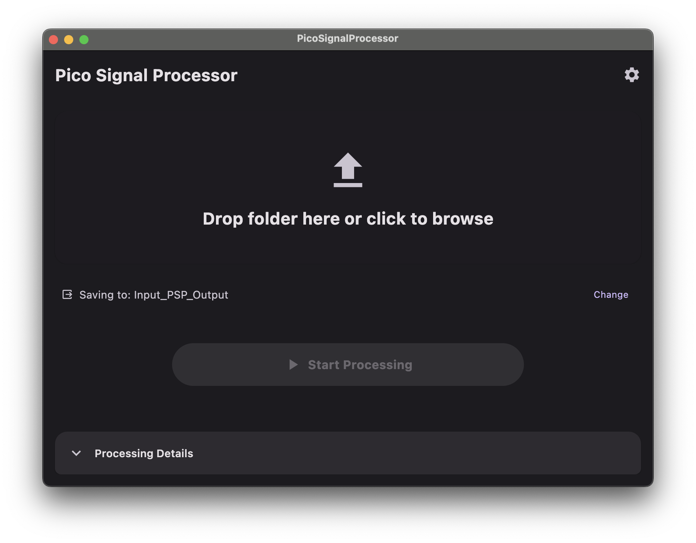

# Pico Signal Processor (PSP)

[](https://kotlinlang.org)
[](https://www.jetbrains.com/lp/compose-multiplatform/)
[](https://openjdk.org/)
[](https://opensource.org/licenses/MIT)

**Fast, Modern CSV Signal Analysis for Oscilloscope Data & Beyond.**

Stop fighting sluggish spreadsheets and manual data extraction. **Pico Signal Processor (PSP)** is a high-performance, cross-platform desktop application designed to batch-process millions of signal data points in milliseconds.


*(Replace this with a screenshot of your Control Center dashboard)*

---

## ⚡ Why PSP?

Processing 10,000+ signal points or hundreds of files manually is slow. PSP uses **Kotlin Coroutines** to scale analysis across your entire CPU (from 2 to 16+ threads), turning minutes of manual work into seconds of automated precision.

### 🎯 Key Features

- **PicoScope Native Support**: Optimized for standard oscilloscope CSV exports with automatic header handling.
- **Blazing Performance**: Multi-threaded CSV parsing ensures no lag, even with massive datasets.
- **Modern "Control Center" UX**: Drag and Drop folder selection, real-time progress bars, and a clean Material 3 interface.
- **Smart Summaries**: Automatic MAX/MIN value extraction and configurable frequency distribution reports.
- **Dark Mode Support**: A sleek interface that adapts to your system theme.

---

## 🆚 Why not just use Excel?

| Feature | Microsoft Excel | Pico Signal Processor |
| :--- | :--- | :--- |
| **Load Speed** | Slow for large CSVs (>1M rows) | Blazing fast (Stream-based) |
| **Batching** | Manual per file | Automatic folder-wide processing |
| **CPU Usage** | Single-threaded | Multi-threaded scalability |
| **Focus** | Generic spreadsheet | Specialized Signal Analysis |

---

## 📁 Data Format Compatibility

PSP is designed for flexibility. While it excels at PicoScope data, it works with any CSV signal data that follows this simple schema:

1. **Header Lines**: The app automatically skips the first **2 lines** (metadata/headers).
2. **Data Columns**: Expects `[Index/Time, Value]`.
3. **File Scanning**: Recursively finds every `.csv` file in your selected input directory.

---

## 🚀 Getting Started

### Prerequisites
- [JDK 17+](https://adoptium.net/) or higher must be installed on your system.

### Build and Run
Clone the repository and run the application directly from your terminal:

```shell
# macOS / Linux
./gradlew :composeApp:run

# Windows
.\gradlew.bat :composeApp:run
```

---

## 🗺️ Roadmap
- [ ] **Android/iOS Targets**: Bringing signal analysis to mobile via Compose Multiplatform.
- [ ] **Web Support**: Browser-based analysis using Kotlin/Wasm.
- [ ] **Advanced Filtering**: Noise reduction and signal smoothing algorithms.

## 🤝 Contributing
Contributions are welcome! If you have ideas for new signal processing operations or UI improvements, please open an issue or submit a PR.

---

*Built with ❤️ using [Kotlin Multiplatform](https://www.jetbrains.com/help/kotlin-multiplatform-dev/get-started.html).*